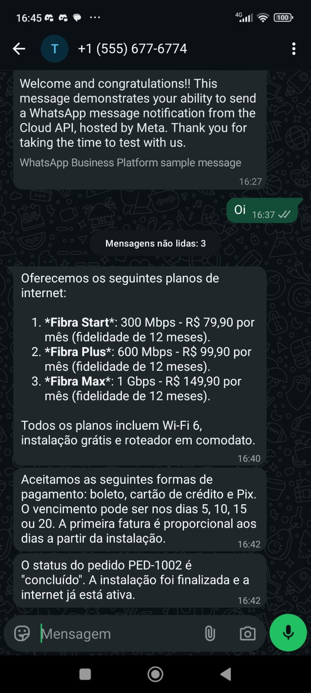

# Desafio Técnico — Desenvolvedor(a) Backend (Node.js)

> **Atendimento WhatsApp com IA** — um cenário real do nosso dia a dia.

Bem-vindo(a)! Este desafio simula um problema que resolvemos de verdade na Myde: receber
mensagens de clientes pelo **WhatsApp**, processá-las com uma **LLM (OpenAI)** e responder
automaticamente — de forma assíncrona, segura e isolada por cliente (multi-tenant).

Não buscamos o "código mais bonito". Buscamos entender **como você pensa**: as decisões de
arquitetura, os trade-offs que você reconhece e o que você conscientemente deixou de fora.

---

## 🎯 O que você vai construir

Um backend em **Node.js + TypeScript** que:

```
   Cliente no WhatsApp
        │  (mensagem)
        ▼
   Meta WhatsApp Cloud API
        │  POST webhook (assinado)
        ▼
 ┌─────────────────────────┐
 │   SEU BACKEND           │
 │  1. valida assinatura   │
 │  2. persiste a mensagem │
 │  3. enfileira o job ────┼──► fila (Redis/BullMQ ou SQS)
 │  4. responde 200 rápido │            │
 └─────────────────────────┘            ▼
                                 ┌──────────────────┐
                                 │   WORKER         │
                                 │  - monta contexto│
                                 │  - chama OpenAI  │
                                 │  - envia resposta├──► Meta API (mock) ──► Cliente
                                 └──────────────────┘
```

Para você focar no que importa, **já fornecemos** um servidor que **simula a Meta** (recebe
seus envios e dispara webhooks assinados pra você), uma base de conhecimento e toda a infra
local via Docker.

---

## ✅ Requisitos

### 1. Webhook da Meta
- **Verificação (`GET /webhook`)**: responder ao handshake da Meta com o `hub.challenge`
  quando o `hub.verify_token` bater com o seu `META_VERIFY_TOKEN`.
- **Recebimento (`POST /webhook`)**: validar a assinatura `X-Hub-Signature-256`
  (HMAC-SHA256 do **corpo cru** da requisição usando o `META_APP_SECRET`). Requisição com
  assinatura inválida deve ser rejeitada.

### 2. Persistência
- Modele e persista **contatos**, **conversas** e **mensagens** (inbound e outbound).
- Sugerimos **PostgreSQL + Drizzle ORM** (já no docker-compose), mas você pode usar outro
  ORM/driver se justificar.

### 3. Processamento assíncrono
- **Não** chame a OpenAI dentro do handler do webhook. Responda `200` rápido e processe
  em background.
- Use **BullMQ + Redis** (fornecido) ou **SQS via LocalStack** (também fornecido) — sua escolha.

### 4. Worker → OpenAI
- O worker monta o contexto (histórico da conversa + `knowledge-base/`) e chama a OpenAI
  para gerar a resposta.
- A resposta deve se basear na base de conhecimento. Se a info não existir lá, o bot deve
  dizer que não sabe (não inventar).
- **Diferencial**: `function calling` para uma ação real (ex.: consultar status de um pedido
  num endpoint mock).

### 5. Envio da resposta
- Envie a resposta via `POST http://mock-meta:8001/{phoneNumberId}/messages`
  (mesma forma da API real da Meta). O mock loga o que recebeu.

### 6. API REST mínima
- `GET /conversations` — lista conversas (do tenant autenticado).
- `GET /conversations/:id/messages` — mensagens de uma conversa.

### 7. Aspectos transversais (é aqui que a gente repara)
- **Idempotência**: a Meta reentrega o mesmo webhook (mesmo `message.id`). Não processe duas vezes.
- **Multi-tenant**: cada cliente (tenant) só enxerga seus próprios dados.
- **Resiliência**: erros na OpenAI/envio devem ter retry; o sistema não pode travar.
- **Observabilidade**: logs estruturados que ajudem a depurar um atendimento específico.

---

## 📦 O que já fornecemos

| Item | Onde |
|------|------|
| Mock da Meta (dispara webhooks assinados + recebe envios) | [`mock-meta-server/`](mock-meta-server/) |
| Base de conhecimento da empresa fictícia | [`knowledge-base/`](knowledge-base/) |
| Infra local (Postgres, Redis, LocalStack, mock) | [`docker-compose.yml`](docker-compose.yml) |
| Variáveis de ambiente de exemplo | [`.env.example`](backend/.env.example) |
| Esqueleto do projeto (package.json, tsconfig, drizzle) | raiz / [`src/`](backend/src/) |
| Guia para obter credenciais reais da Meta e OpenAI | [`SETUP-CREDENCIAIS.md`](SETUP-CREDENCIAIS.md) |

> Você pode fazer **todo o desafio sem credenciais reais da Meta**, usando o mock. A OpenAI
> exige uma API key (o guia explica como obter com baixíssimo custo). Se preferir, deixe a
> chamada da LLM atrás de uma interface e forneça um "stub" — mas a integração real conta pontos.

---

## 🚀 Como começar

```bash
# 1. Suba a infraestrutura (Postgres, Redis, LocalStack, mock da Meta)
docker compose up -d

# 2. Confira que o mock da Meta está no ar
curl http://localhost:8001/health

# 3. Copie as variáveis de ambiente e preencha sua OPENAI_API_KEY
cp .env.example .env

# 4. Instale dependências e desenvolva sua solução em src/
npm install   # ou bun install / pnpm install

# 5. Quando seu webhook estiver no ar (porta 8000), simule uma mensagem de cliente:
curl -X POST http://localhost:8001/simulate/inbound \
  -H "Content-Type: application/json" \
  -d '{ "from": "5511999990000", "text": "Quais são os planos de vocês?" }'

# O mock vai ASSINAR o payload e chamar seu POST http://host.docker.internal:8000/webhook
# Seu backend processa, chama a OpenAI e envia a resposta de volta pro mock.
```

A porta esperada do **seu** backend é a **8000**.

---

## 📤 Entrega

- Repositório Git (público ou com acesso) com **histórico de commits real** (não um único commit).
- `README.md` próprio explicando: como rodar, suas decisões de arquitetura, **premissas** e
  o que você deixaria para depois (e por quê).
- Pelo menos **5 testes** cobrindo a lógica de negócio (validação de assinatura, idempotência,
  serviço de conversa, etc.).

---

## 🧮 Critérios de avaliação

| Critério | Peso | O que olhamos |
|----------|------|---------------|
| Arquitetura & organização | 25% | Separação de responsabilidades, fronteiras claras, modularidade |
| Corretude do fluxo assíncrono | 20% | Webhook responde rápido, worker processa, retry em falhas |
| Segurança & idempotência | 20% | Assinatura validada, reentrega tratada, multi-tenant isolado |
| Qualidade do código | 15% | Legibilidade, tipagem, tratamento de erros, naming |
| Integração com a LLM | 10% | Contexto/RAG, respostas fiéis à base, controle de custo |
| Testes | 10% | Cobrem cenários relevantes, não só caminho feliz |

---

## 📋 Regras

- **Prazo**: 5 dias corridos a partir do recebimento.
- **Linguagem**: Node.js + TypeScript.
- Bibliotecas à sua escolha — documente o porquê das principais.
- Pode usar IA como assistente. Mas **você precisa entender e defender cada decisão** —
  na entrevista vamos conversar sobre o seu código.

Boa sorte! 🚀

---

## 🛠️ Solução implementada (candidato)

Implementação completa em **NestJS + TypeScript + Drizzle (Postgres) + SQS (LocalStack)**,
com **modo híbrido** (real **ou** simulado, independente por provedor) e auditoria de tudo.

```bash
# na RAIZ (onde está o .env central que orquestra tudo)
docker compose up -d --build
curl http://localhost:8000/health
curl -X POST http://localhost:8001/simulate/inbound \
  -H "Content-Type: application/json" \
  -d '{ "from": "5511999990000", "text": "Quais são os planos de vocês?" }'
curl http://localhost:8001/sent
```

Sobe **100% simulado sem credenciais**. Para usar OpenAI/Meta reais, ajuste `OPENAI_MODE`/
`META_MODE` no `.env` (veja `envexample.txt`). Combinações livres — ex.: **OpenAI real + Meta
simulada**.

- Como rodar, endpoints e modo híbrido: [`backend/README.md`](backend/README.md)
- Arquitetura: [`backend/docs/ARCHITECTURE.md`](backend/docs/ARCHITECTURE.md)
- Decisões e trade-offs: [`backend/docs/DECISIONS.md`](backend/docs/DECISIONS.md)
- Runbook (testar webhook, idempotência, DLQ, auditoria): [`backend/docs/RUNBOOK.md`](backend/docs/RUNBOOK.md)
- Testes: `cd backend && npm test` (30 testes unitários em `backend/tests/unit`)

> Cobertura dos requisitos: webhook assinado (raw body), persistência com **rollback**,
> **idempotência**, processamento assíncrono com **retry/DLQ**, RAG fiel à base (responde
> "não sei" quando não há contexto), **function calling** (status de pedido `PED-XXXX`),
> envio via Meta, REST multi-tenant, **interceptor de auditoria** (fila → fallback → log),
> **rate limit** (Throttler) + **headers de segurança** (Helmet) e tudo orquestrado por Docker.

### 📲 Prova de funcionamento (WhatsApp real)

Fluxo completo rodando com **OpenAI real + WhatsApp Cloud API real**: o cliente manda "Oi",
e o backend (webhook assinado → fila SQS → worker → OpenAI com RAG/function calling → envio
Meta) responde com os planos, formas de pagamento e o status do pedido `PED-1002` — entregue
de verdade no WhatsApp:



> As respostas são fiéis à `knowledge-base/` (planos Fibra Start/Plus/Max, pagamento via
> boleto/cartão/Pix) e a do pedido veio da **function calling** (`PED-1002` concluído).
